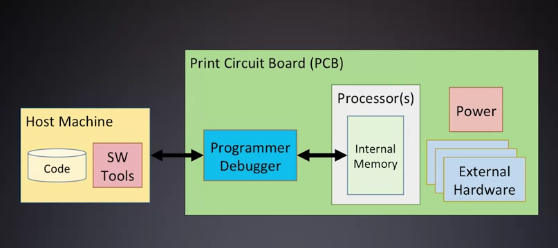
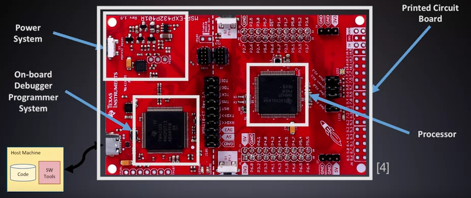
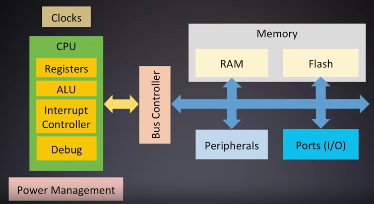

In this video, we'll introduce the concept of an embedded system and
what basic components are needed to bring an embedded application to life.
This includes a number of hardware and
software elements, describe the target architecture and the design environment.
We start by defining formally whan an embedded system is.
An embedded system is a computerized system that is purpose built for
its application.
Each embedded system has a special purpose and constraints in their system resources.
Such as processing, memory, and peripherals.
Typically, a program or aspect of either software language or
hardware description language is included in addition to the physical hardware
to run these programs on.
The hardware is a combination of a processing core, and external circuits for
the processor to interact with.
A software installer combines these two pieces by loading software image
into the processor's memory.
This differs from any general computer systems that you've worked on
such as your personal computers or server architectures.
Those platforms are designed to work with a variety of applications
dynamically adding and removing programs through the lifetime of the platform.
This is made possible because of an extensive amount of processing power and
memory resources.
Specific design decisions will be made in each embedded application for
levels of performance, power, and timing.
By directly quantifying these characteristics,
you can begin to create a list of functional specifications.
These specs provide detailed criteria
needed to evaluate the capabilities of different target platforms.
This analysis is dependent on the hardware architecture and
how efficient your coding is.
The software development platform you will interact with has many parts.
First, the target embedded system will likely use
printed circuit board technology, or PCBs.
A PCB is a substrate with conductive wires.
It interconnects many integrated circuits and
passive developments that all have been soldered on to the board.
This includes your processor and your power converters.
An external programmer is connected to the embedded systems processor,
in order to install a target application into the internal memory.
Modern designs have begun to integrate extra onboard programmer debugger
hardware to simplify this process.
A host machine is responsible for developing and compiling and coordinate
the install which is equally as important as development of the system PCB itself.
The host machine is where your software files live.
An embedded software engineer will focus in becoming an expert on the host development
environment, the tools and most importantly, the processor.
A quick example with the launch pad from the Texas Instrument
shows an example of these systems on a PCB.
You can see the processor, the debugger emulator programmer and the PCB itself.
One solution for the processing core would be a microcontroller.
Microprocessors and microcontroller are not the same.
A microcontroller is a microprocessor with added functionality such as memory and
peripheral hardware.
The processor part of the microcontroller is called the CPU or
the Central Processing Unit.
This is a piece of hardware that runs our software by fetching and
executing assembling instructions for memory.
These instructions perform math and logic operations
as well as coordinating data movement.
The CPU has many sub components with many responsibilities.
Many registers, general purpose and special purpose,
store operations data and systems state.
An Arithmetic Logic Unit, or the ALU, performs the fundamental low level assembly
operations, an Interrupt Controller
coordinates a synchronous event request of the processor.
Lastly a Debug interface is used to help troubleshoot installed programs.
The CPU and its subsystems interact with other microcontroller resources
through one or more buses.
A bus controller aids the processor in this data transmission between memory and
peripherals.
Memory holds data that we operate on as well as the program that we're executing.
This data is stored in a combination of flash and Random Access Memory or RAM.
A clock system provides synchronizations across all these components.
And to wrap up on trip power management hardware is used for
regulation and monitoring.
A variety of peripheral hardware maybe included in a micro controller.
Some typical peripheral functionality you will see include communication,
analog signal processing, input and output, timing and processor support.
An example Microcontroller can be seen in the Texas instrument's MSP432.
This contains one of the arm cortex info processors and
a large number of peripheral harbor sub systems.
Each of the core microcontroller components are represented
in this architecture and there are numerous modules of each peripheral types.
This module investigated many of the components that embedded software
engineers have to interact with and create embedded applications.
However, understand that a software engineer's job
is to create an optimized robust solution for these systems.
Embedded systems are unique software platforms because they do not have
an abundance of computation power, memory, or peripheral hardware.
Focusing on writing software that can officially code around those limitation
Will be a prime focus for this course.
To do this, we will need to bring into play many software tools and
our knowledge of the processor. 